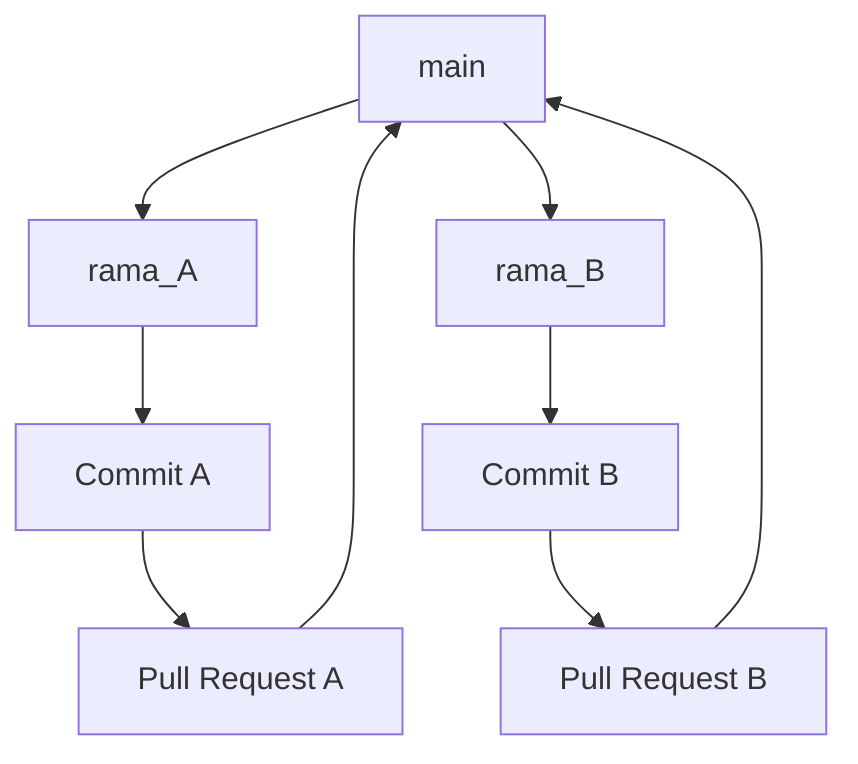

# Práctica 4  
## Pruebas de caja negra con Selenium sobre interfaces web  

**Curso 2025/2026 – Calidad del Software**

---

## Objetivos

- Comprender el uso de **Selenium WebDriver** para la automatización de pruebas funcionales sobre interfaces web.  
- Diseñar **casos de prueba de caja negra** sobre formularios sin recurrir al código fuente.  
- Identificar **clases de equivalencia válidas e inválidas** y los **valores límite** de los campos de entrada.  
- Implementar las pruebas de forma automatizada en **JUnit 5 + Selenium**.  
- Detectar y documentar **errores funcionales y de validación** del formulario probado.  
- Consolidar el trabajo colaborativo en GitHub empleando **ramas, commits y pull requests**.

---

## Entorno de trabajo

- **Eclipse IDE 2025-06 (4.36.0)**  
  - Soporte integrado para **JUnit 5**, **Git** y **JDK ≥ 17**.  
  - Dependencias de **Selenium WebDriver 4.14+** ya incorporadas en el proyecto Maven.  
  - Navegador **Google Chrome** actualizado y **ChromeDriver** compatible.  

### Nota importante

Si se usa el ordenador personal:

- Verificar que está instalado **JDK 17 o superior** y **Google Chrome** actualizado.  
- Descargar la versión de **ChromeDriver** que coincida con la versión instalada del navegador y colocarla en el PATH o en la carpeta del proyecto.  
- Verificar la ejecución correcta de una prueba simple con Selenium antes de comenzar los ejercicios.  
- Si aparece el error `SessionNotCreatedException`, comprobar la compatibilidad entre `chromedriver` y la versión de Chrome.

---

## Contexto

La plataforma **Formandera.com** ofrece cursos organizados por temáticas.  
En esta práctica se probará el funcionamiento de dos formularios que permite a un usuario **consultar descuentos de cursos**, en función a diferentes condiciones, y **buscar cursos recomendados y sus descuentos** en función de sus características, preferencias y otras condiciones.

Así se distinguen dos formularios sobre los que realizaremos las pruebas de caja negra:

- formulario `descuentos`
- formulario `buscar`

## Formulario `descuentos`

El formulario **“descuentos”** permite a un usuario de la plataforma **Formandera.com** calcular el **porcentaje de descuento** y el **precio final** de un curso según su historial de formación y su tipo de cuenta.  
El cálculo se realiza conforme a reglas de negocio internas de la plataforma.  

Este formulario constituye la interfaz a probar en la **parte 1** de la práctica, donde se aplicarán pruebas de **caja negra** mediante **Selenium WebDriver** para verificar los comportamientos esperados, la validación de entradas y los mensajes de error mostrados al usuario.


###  Campos del formulario

| Campo | Tipo de dato | Descripción | Restricciones / Validaciones |
|--------|---------------|-------------|-------------------------------|
| **Número de cursos previos (`id = "nCursosPrevios"`)** | Entero | Cantidad de cursos que el usuario ha completado anteriormente en la plataforma. | Debe ser un número entero mayor o igual que 0. Si se introduce un número negativo, se mostrará el mensaje de error (`id = "alert"`): *“Error: El número de cursos no puede ser negativo.”* |
| **Usuario premium (`id="esPremium"`)** | Checkbox / booleano | Indica si el usuario tiene una cuenta premium activa. | Campo opcional. Por defecto se considera `false` (no premium). |
| **Precio base (`id="precioBase"`)** | Decimal | Precio original del curso que se desea contratar. | Debe ser un número mayor que 0. Si se introduce 0 o un valor negativo, se mostrará el mensaje de error (`id = "alert"`): *“Error: El precio base debe ser mayor que 0.”* |
| **Botón Calcular (`id="btnCalcular"`)** | Botón | Envía los datos introducidos al servidor y muestra el descuento aplicado y el precio final. | — |

---

### Especificaciones funcionales
Una vez seleccionados los valores de los campos el sistema valida y responde siguiendo las reglas:

1. Si el usuario ha completado **más de 10 cursos**, obtiene un **10 % de descuento**.  
2. Si ha completado **más de 20 cursos y es usuario premium**, obtiene un **25 % de descuento**.  
3. En cualquier otro caso, **no se aplica descuento alguno**.

### Salida esperada del formulario
Tras pulsar **Calcular**, la aplicación muestra una nueva vista con los siguientes campos:

| Campo mostrado | Descripción | Ejemplo |
|----------------|--------------|----------|
| **Porcentaje de descuento (`id="porcentaje"`)** | Descuento aplicado en función de los criterios anteriores. | “10 %” |
| **Precio final (`id="precioFinal"`)** | Precio resultante tras aplicar el descuento. | “90.00 €” si el precio base era 100 € y el descuento 10 % |
| **Mensajes de error (`id="alert"`)** | Texto en color rojo que aparece en la parte superior del formulario si se introduce un valor inválido. | “Error: El número de cursos no puede ser negativo.” o "Error: El precio base debe ser mayor que 0." |
| |

## Formulario `buscar`

El formulario `buscar` permite introducir los siguientes campos:

| Campo | Tipo | Descripción |
|--------|------|-------------|
| **Edad (`id="edad"`)** | numérico | Edad del usuario (mínimo 12 años). |
| **Temática de interés (`id="temática"`)** | texto | Categoría o área de interés (por ejemplo: *Programación*, *Arte*, *Ofimática*). |
| **Puntuación mínima deseada (`id="puntuacionMinima"`)** | numérico | Valoración mínima de los cursos a buscar (entre 1 y 5). |
| **Cursos completados (`id="cursosCompletados"`)** | numérico | Número de cursos finalizados previamente (≥ 0). |
| **Botón Buscar (`id="btnBuscar"`)** | botón | Ejecuta la búsqueda y muestra los resultados en tabla. |

### Especificaciones funcionales

El sistema valida y responde de acuerdo con las siguientes reglas:

1. **Edad mínima:** 12 años.  
2. **Puntuación mínima:** entre 1 y 5 (inclusive).  
3. **Cursos completados:** número entero ≥ 0.  
4. **Mensajes de error:** Si algún campo no cumple las restricciones, se mostrará una alerta roja (`alert-danger`) con el mensaje correspondiente.  
5. **Descuentos aplicados:**  
   - Edad 12-18 y 1-5 cursos → 20 %  
   - Edad > 55 y ≥ 1 curso → 30 %  
   - Más de 10 cursos → descuento adicional del 5 % (acumulable)  
6. **Salida:** Tabla con cursos disponibles para la temática y edad, mostrando el precio base y el precio con descuento.
7. **Mensajes de error** que se pueden mostrar:
    - Error: La edad mínima es 12 años
    - Error: La puntuación mínima debe estar entre 1 y 5
    - Error: Temática requerida
    - Error: Número de cursos inválido  

---

## ¿Qué es Selenium?

**Selenium** es un conjunto de herramientas de código abierto diseñado para **automatizar la interacción con navegadores web**.  
Permite simular las acciones de un usuario real (abrir una página, rellenar formularios, hacer clic en botones, verificar resultados) y comprobar automáticamente si el comportamiento de la aplicación es el esperado.

### Componentes principales

- **Selenium WebDriver:** API que controla el navegador (Chrome, Edge, Firefox…).    
- **ChromeDriver:** controlador que permite a Selenium comunicarse con el navegador elegido.

### Ejemplo mínimo de uso

```java
WebDriver driver = new ChromeDriver();
driver.get("http://localhost:8080/buscar");

// El campo edad es un imput identificado con el id="edad"
// Capturamos el elemento del DOM por el id
WebElement edad = driver.findElement(By.id("edad"));
//Simulamos la acción de teclear la cadena o número que vayamos a poner en el campo
edad.sendKeys("11");

// Capturamos el boton que lanza el caso de uso mediante su id
// Simulamos el pulsado del elemento.
driver.findElement(By.id("btnBuscar")).click();

// Capturamos el elemento del DOM que muestra el mensaje de error por su id
WebElement alerta = driver.findElement(By.id("alertError"));

//Comprobamos que el mensaje mostrado coincide con el esperado
assertTrue(alerta.getText().contains("La edad mínima es 12 años"));
driver.quit();
```

Para más información sobre el uso de Selenium pueden consultarse las siguientes páginas:

- [Página oficial de Selenium](https://www.selenium.dev/documentation/overview/)
- [¿Cómo automatizar pruebas con selenium?](https://profile.es/blog/como-automatizar-pruebas-con-selenium/)

---

## Forma de trabajo

- Se creará un repositorio de **GitHub** con el nombre `CalSo2526_P4-grupoXX`, donde *XX* representa el número del grupo.  
- Cada miembro del grupo trabajará en una rama personal, siguiendo el flujo habitual: commits frecuentes, `push` diario y posterior `merge` a la rama `main`.  



---

## Ejercicios propuestos

### 1. Análisis de los formularios y de sus elementos

Para cada formulario:
- Identificar los campos de entrada y sus restricciones.  
- Elaborar una **tabla de equivalencias** para cada campo, diferenciando **clases de equivalencia válidas e inválidas**, y señalando los **valores límite**.  

**Ejemplo de tabla (campo “Edad”)**

| Parámetro | Tipo | Clases inválidas | Clases válidas |
|------------------------|------|-------------------------|--------------------|
| Edad | numérico | CE01: Edad<12 | CE02: Edad>=12 |
|  |


### 2. Diseño de casos de prueba (caja negra)

Para cada formulario, se elaborará una **tabla general de diseño de casos de prueba** que cubra todas las clases de equivalencia válidas e inválidas de los campos de cada formulario. En esta tabla deberá haber casos de prueba que cubra cualquier combinación donde todas las clases son válidas y cualquier combinación donde todas las clases son válidas menos una que será inválida.

**Formato de la tabla:**

| Nº | Nombre del caso | Clases de equivalencia cubiertas | Valores de entrada (edad, temática, puntuación, cursos) | Valor esperado | Valor observado |
|----|-----------------|----------------------------------|---------------------------------------------------------|----------------|-----------------|
| 1 | testGivenEdad11TematicaProgramacionPuntuacionMinima4DotCeroYCursosCompletado3WhwnBuscarThenMensajeErrorEdadMinima | **CE01**...(otras del resto de parámetros) | 10, Programación, 4.0, 3 | Error: “La edad mínima es 12 años” | - |
| |


---

### 3. Implementación de pruebas automatizadas con Selenium

- Implementar en **JUnit 5** las pruebas diseñadas en el apartado anterior.  
- Cada caso de prueba abrirá el formulario, introducirá los valores, pulsará el botón **Buscar** y verificará el mensaje o los resultados esperados.

**Recomendaciones:**

- Crear una clase de prueba `CourseSearchSeleniumTest.java` en la carpeta `src/test/java`.  
- Usar el patrón de nombres: `test_given_X_when_Y_then_Z`.  
- Limpiar los recursos con `driver.quit()` en un método `@AfterEach`.  
- Agrupar las pruebas en suites según la validez de las entradas.  
- Si un caso falla, registrar en la tabla “Valor observado” el mensaje real mostrado por la aplicación.

---

### 4. Realizar el análisis de valores límite

Para cada formulario, se deberán identificar los valores límite de los parámetros de interés. Se recuerda que los valores límite se deben identificar de forma que en dichos límites pude cambiar la lógica de la aplicación porque se pase de un error a un valor ordinario o porque cambie la salida. Por ejemplo, de un valor con descuento 0 a otro co descuento del 10 %.

Incorporar los nuevos test a las tablas del ejercicio 2, identificando las que se añaden por el método de valores límite.

### 5. Implementación de los nuevos casos de prueba con Selenium

Para cada case de prueba de os formuarios se añadiran los casos de prueba derivados del proceso de análisis de valores límites. 


### 6. Documentación y cobertura

- Documentar en el `README.md` del repositorio los **casos de prueba implementados** y sus **resultados observados**.  
- Añadir las tablas de equivalencias, las tablas de diseño de pruebas y las capturas de pantalla de los errores o alertas detectadas.  
- Cada miembro documentará los casos desarrollados en su rama personal antes del `merge` final.

---

## Previo

- Crear un repositorio privado en **GitHub** con el nombre `CalSo2526_P4-grupoXX`.  
- Crear un **README.md** inicial con el nombre y correo institucional de cada integrante.  
- Crear ramas personales siguiendo el formato: *inicialesNombreApellidos_P4*.  
- Verificar la correcta ejecución de los formularios en `http://localhost:8080/descuentos` y `http://localhost:8080/buscar` antes de iniciar las pruebas.


---

## Entregables

- En la tarea del Aula Virtual: enlace al repositorio GitHub que contenga:  
  - Proyecto Maven completo y ejecutable (`FormanderaDiscountsApplication.java`).  
  - En la carpeta `src/test/java`: pruebas Selenium implementadas en las clases: 
    - `DiscountFormSeleniumTest.java`
    - `BuscadorCursosSeleniumTest.java`  
  - En `README.md`:  
    - Tablas de clases de equivalencia.  
    - Tablas de diseño de casos de prueba (con valores observados).  
    - Evidencias de ejecución (capturas o logs).  
    - Breve análisis de errores detectados y comportamientos inesperados.  

**Fecha de entrega:** 12/12/2025  

---

## Evaluación

| Criterio | Ponderación |
|-----------|-------------|
| Identificación de clases de equivalencia válidas e inválidas | 0.5 puntos |
| Diseño de casos de prueba de caja negra por cobertura de clases de equivalencia| 1.5 puntos |
| Implementación y automatización con Selenium | 2.0 puntos |
| Identificación de valores límite y diseño de casos de prueba asociados | 2.0 puntos |
| Implementación y automatización con Selenium | 2.0 puntos |
| Documentación (README, tablas, resultados) | 1.0 punto |
| Trabajo en ramas y gestión colaborativa en GitHub | 1.0 punto |

**Total:** 10 puntos  
